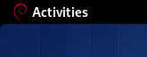

A simple GNOME Shell extension to show Debian logo in "Activites" menu.

Work on Debian 11 (bullseye) and gnome version 3.38.5. Type `make install` to install and `make uninstall` to remove the extension.
